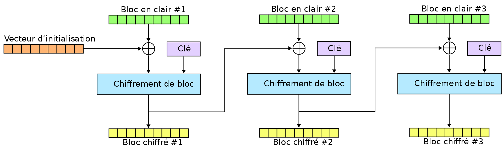
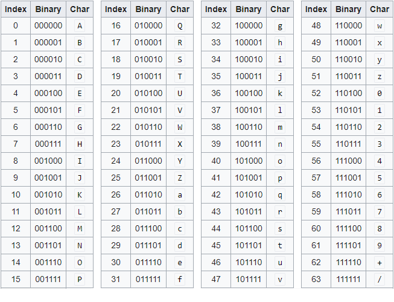
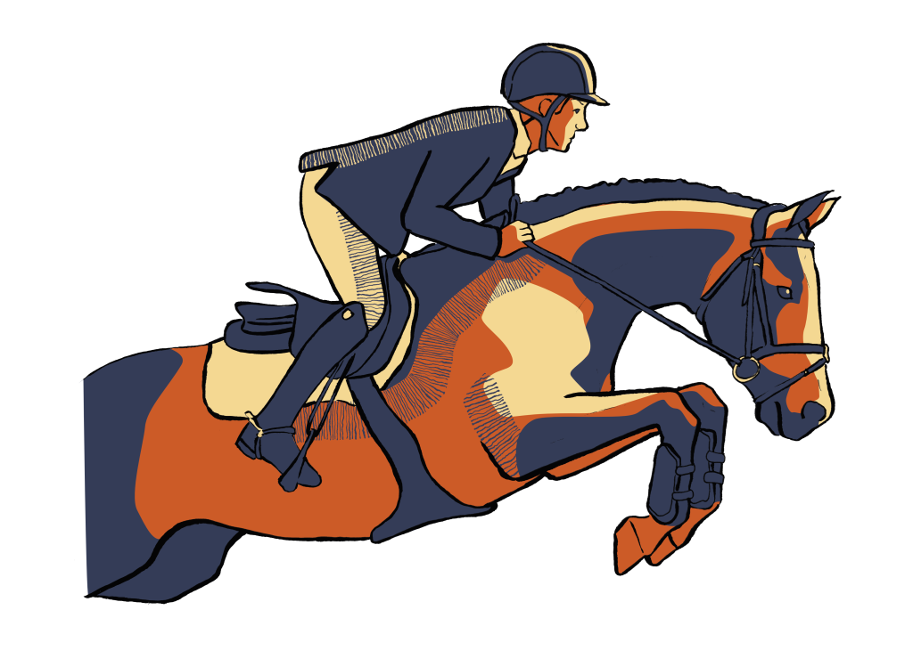

# Chiffrement et base 64

Le chiffrement moderne repose sur des algorithmes plus robustes que ceux étudiés en classe.

<center>
    
</center>

On apprend dans ce TP à utiliser des outils existants pour chiffrer de façon efficace nos données.

## Pour commencer

OpenSSL est une boîte à outils de chiffrement comportant deux bibliothèques fournissant respectivement une implémentation des algorithmes cryptographiques et du protocole de communication SSL/TLS, ainsi qu’une interface en ligne de commande : **openssl**.

!!! note "Important"

    La bibliothèque de chiffrement web open source OpenSSL est affectée par une vulnérabilité pouvant servir à des attaques par déni de service.  
    Les versions 1.0.2, 1.1.1 et 3.0 doivent être mises à jour dès que possible.

### L'encodage 64 bits

L’encodage en base 64 consiste à coder chaque groupe de 24 bits successifs de données par une chaîne de 4 caractères.  
On procède du début à la fin, en concaténant 3 octets pour créer un seul groupement de 24 bits.  
Ils sont alors séparés en 4 nombres de seulement 6 bits.  
Chacune des 4 valeurs est enfin représentée (codée) par un caractère de la table ci-dessous :

<center>
    
</center>

Par exemple, pour chiffrer le mot « NSI » on commence par l’écrire en binaire avec la table ASCII :

<center>

| **N**    | **S**    | **I**    |
|:--------:|:--------:|:--------:|
| 01001110 | 01010011 | 01001001 |

</center>

que l'on découpe ensuite en paquet de 6 bits :

<center>

| Paquet 1   | Paquet 2   | Paquet 3   | Paquet 4   |
|:----------:|:----------:|:----------:|:----------:|
| 010011 | 100101 | 001101 | 001001 |

</center>

on récupère alors les caractères associés dans la table :

<center>

| Paquet 1   | Paquet 2   | Paquet 3   | Paquet 4   |
|:----------:|:----------:|:----------:|:----------:|
| T | I | N | J |

</center>

!!! warning

    Un traitement spécial est effectué si moins de 24 bits sont disponibles à la fin de la séquence de données à coder (elle n’a pas forcément une taille multiple de 24 bits). Dans un tel cas, des zéros sont ajoutés à la droite des données initiales pour aller vers le multiple de 6 bits le plus proche. Chaque paquet de 6 bits est converti dans l’alphabet. Puis on ajoute des caractères « = » complémentaires pour former quand même 4 caractères.

!!! question "Pour commencer"

    1. Encoder le mot **TARANTINO** en base 64.
    2. Décoder le mot **UkFDTEVUVEU=** qui a été encodé en base 64.

### Avec OpenSSL

OpenSSL s’utilise dans un terminal Linux. Il se présente sous la forme d’un programme en ligne de commande auquel on passe quelques options et paramètres.  

Par exemple, pour encoder le texte "**La raclette est moelleuse !**", on écrit :

``` bash title="Utilisation d'OpenSSL dans un terminal"

echo -n "La raclette est moelleuse !" | openssl enc -base64
```

et on obtient **TGEgcmFjbGV0dGUgZXN0IG1vZWxsZXVzZSAh**.  

!!! info "Important"

    L'option `-n` permet de ne pas prendre en compte le retour chariot (lorsqu'on valide avec la touche Entrer).

Pour décoder, un texte encodé avec la base 64, on ajoute l'option `-d` et on enlève l'option `-n` :

``` bash title="Utilisation d'OpenSSL dans un terminal"

echo "SidhZG9yZSBsZXMgcG9tbWVzIGQnYW1vdXIgIQ==" | openssl enc -base64 -d
```

!!! note

    Je vous laisse découvrir le message.

Il est également possible d’encoder des fichiers entiers.  

!!! question "Avec des fichiers"

    1. Commencer par télécharger le fichier [tirade.txt](<./files/tirade.txt>). et placer le dans votre répertoire de travail.
    2. Ouvrir un terminal dans ce dossier et tester la commande :

        ``` bash title="OpenSSL et fichiers"

        openssl enc -base64 -in tirade.txt -out tirade.b64
        ```
        
        Observer alors le contenu du fichier **tirade.b64** à l'aide de la commande 

        ``` bash title="OpenSSL et fichiers"

        cat tirade.b64
        ```
    3. Déchiffrer ce nouveau fichier à l'aide de la commande :

        ``` bash title="OpenSSL et fichiers"

        openssl enc -base64 -d -in tirade.b64 -out tirade_dechiffre.txt
        ```

    4. Télécharger le fichier [secret.b64](<./files/secret.b64>), décoder le puis chanter.

### Application pour les mails

Lors de l’envoi d’email, les images en pièce jointe sont souvent encodées en base64.  
On a justement intercepté l'email d'un élève de NSI dans lequel se trouvait une image (encodée en base 64).

<center>
    
</center>

!!! question "Avec des images"

    1. Télécharger le fichier [image.b64](<./files/image.b64>).
    2. Décoder la grâce à OpenSSL (c'est une image png).
        
## Utiliser des chiffrements modernes

### Présentation de Blowfish

Blowfish est un algorithme de chiffrement symétrique par blocs conçu par Bruce Schneier en 1993.

Blowfish utilise une taille de bloc de 64 bits et la clé de longueur variable peut aller de 32 à 448 bits. Elle est basée sur l’idée qu’une bonne sécurité contre les attaques de cryptanalyse peut être obtenue en utilisant de très grandes clés pseudo-aléatoires.

### Avec OpenSSL

On cherche à chiffrer l'image ci-dessous avec l'algorithme Blowfish.

<center>
    
</center>

!!! question

    1. Commencer par télécharger l'image en cliquant sur [le lien](<./images/kb.png>).
    2. Une fois dans le terminal (au bon endroit), taper la commande :

        ``` bash title="OpenSSL et Blowfish"

        openssl enc -bf -in kb.png -out kb.bf -provider legacy -provider default
        ```

        !!! warning "Attention"

            Après validation, il vous sera demandé de taper un mot de passe.
            Taper le (il n'apparaît pas, c'est normal) et valider.  

            Vous aurez besoin de ce mot de passe pour déchiffrer l'image.

    3. Déchiffrer alors le fichier **kb.bf** à l'aide de la commande :

        ``` bash title="OpenSSL et Blowfish"

        openssl enc -bf -d -in kb.bf -out kb_dechiffre.png -provider legacy -provider default
        ```

        !!! tip "Information"

            Votre mot de passe a été demandé ici !

### Pour aller plus loin

Nous sommes à la recherche d'une image secrète.  

<center>
    
</center>

Voici les différentes étapes réalisées sur cette image :

* Elle a d'abord été encodée en base 64 ;
* On a encodé un mot de passe en base 64 et on a obtenu **UmFjbGV0dGU=** ;
* On a chiffré l'image encodée avec **Blowfish** et le mot de passe (en clair) ;

!!! question

    1. Télécharger l'image mystère en cliquant sur [ce lien](<./files/mystere.bf>)
    2. Retrouver l'image originale. (Il s'agit d'un gif.)